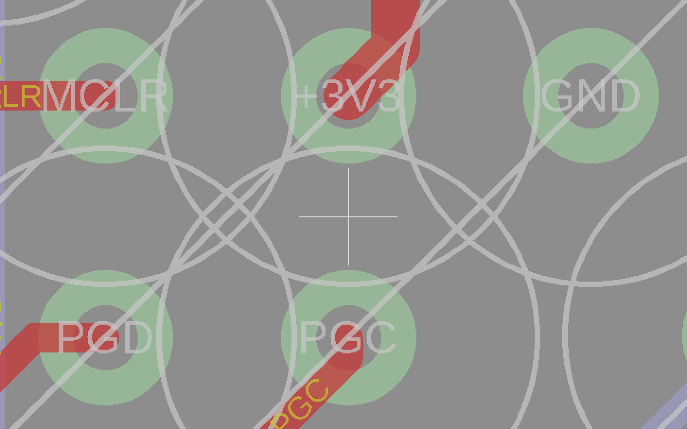

# GC+ - What is it?
GC+ is a custom board that acts as a Gamecube controller with an upgradable firmware and custom features.
Video reference: https://www.youtube.com/watch?v=MTG2iqWmXx4

# What's new in version 2.0?
* Firmware completely written in C
* Complete controller functionality, including analog triggers and rumble
* Hardware emulation of the GC controller protocol
* Includes a rumble motor driver that supports both LRA and ERM rumble motors
* Additional Z2/ZL button to be used as an extra input for the BT emulation hack
* Compatible with 3DS sliders/Switch sticks without an external converter
* Configurable via homebrew with customizations including:
    * Remappable buttons (except triggers) (via PMv2, coming soon!)
    * Configurable triggers mode between digital and analog, allowing to use both standard triggers and dual---action tacts
    * Completely reconfigurable sticks, both in terms of ranges, and relocation
    * A new deadzone mode allowing for smooth transition across the center of the sticks
* Completely upgradeable!

# How to make one?
Eagle files are available in the Hardware folder. Use them to order PCBs from your favourite manufacturer.

# Needed parts
A BOM is available in the Hardware folder

# How to compile it
GC+2.0 is split in two MPLAB IDE projects. All that you need to do is open GCPlus2.0_Bootloader.X in MPLAB IDE and compile it. GCPlus2.0_Bootloader loads GCPlus2.0 internally. This means that when you compile the bootloader, an unified hex file containing both the bootloader and the main payload firmware. The main firmware project is configured to use a different memory region to avoid overlaps with the bootloader.

# How to flash it
Markup : 
Flash GC+2.0.hex with MPLAB IPE (http://microchip.wikidot.com/ipe:installation) and a PICKIT v3 (or above).
Use the above pinout to wire up GC+2.0 to your PICKIT.

# Contacts
Please if you have any questions or if you want to implement new features reach out to me (Aurelio) on BitBuilt.net forums or our Discord server at https://discordapp.com/invite/uwT2AC.

If you use GC+2.0 and/or integrate it in your own project please do not forget to give credits where due and link to this repository.

# License

MIT License

Copyright (c) 2020 Aurelio Mannara

Permission is hereby granted, free of charge, to any person obtaining a copy
of this software and associated documentation files (the "Software"), to deal
in the Software without restriction, including without limitation the rights
to use, copy, modify, merge, publish, distribute, sublicense, and/or sell
copies of the Software, and to permit persons to whom the Software is
furnished to do so, subject to the following conditions:

The above copyright notice and this permission notice shall be included in all
copies or substantial portions of the Software.

THE SOFTWARE IS PROVIDED "AS IS", WITHOUT WARRANTY OF ANY KIND, EXPRESS OR
IMPLIED, INCLUDING BUT NOT LIMITED TO THE WARRANTIES OF MERCHANTABILITY,
FITNESS FOR A PARTICULAR PURPOSE AND NONINFRINGEMENT. IN NO EVENT SHALL THE
AUTHORS OR COPYRIGHT HOLDERS BE LIABLE FOR ANY CLAIM, DAMAGES OR OTHER
LIABILITY, WHETHER IN AN ACTION OF CONTRACT, TORT OR OTHERWISE, ARISING FROM,
OUT OF OR IN CONNECTION WITH THE SOFTWARE OR THE USE OR OTHER DEALINGS IN THE
SOFTWARE.E, ARISING FROM,
OUT OF OR IN CONNECTION WITH THE SOFTWARE OR THE USE OR OTHER DEALINGS IN THE
SOFTWARE.